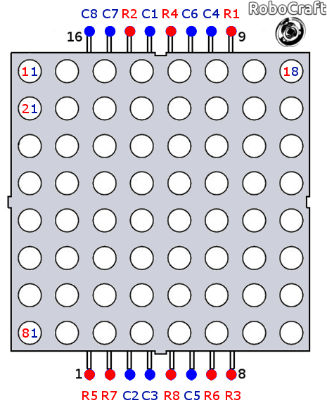
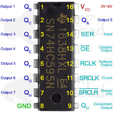

# LED  Matrix Project

The Project mainly is a game using bunch of switches and LED Matrix to display the outcome of the game. The hardware consists of shift registers, bunch of switches  and Tiva C ARM Micro-controller. 

# Files

This is a whole workspace based on the IAR platform but the main project files are displayed as **C and H files**, but using the IAR you can just open it easily.

It has Two LED Matrices (8 * 16) 
## Connections
one shift register for the rows ** All rows are connected together**
two shift register for the Cols Each cols is connected with an output from the shift register ** The two shift registers are combined to be one 16 shift register**

## main.c

This is the main file of the project where it all starts. (contains the main logic of the game).

## Libraries
### keypad 
	keypad contains functions to be easily called and interface with a keypad
### Time 
	It contains delay function to be used any where
###	LCD 
	most of the functions that would be needed when interfacing with a LCD
### LED Matrix 
	Has the main functions to be used when interfacing with an LED MATRIX. The have comments in code 	
	decribing thier functionality

## H Files
All H files contains definitions for connections to easily change port or pins, and contains functions definitions.

# LED MATRIX Diagram 

# Shift Reg IC Diagram 

